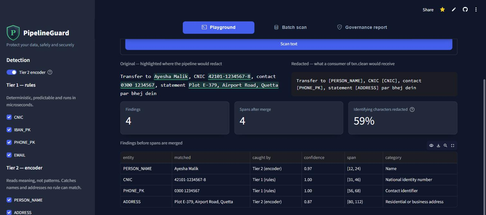
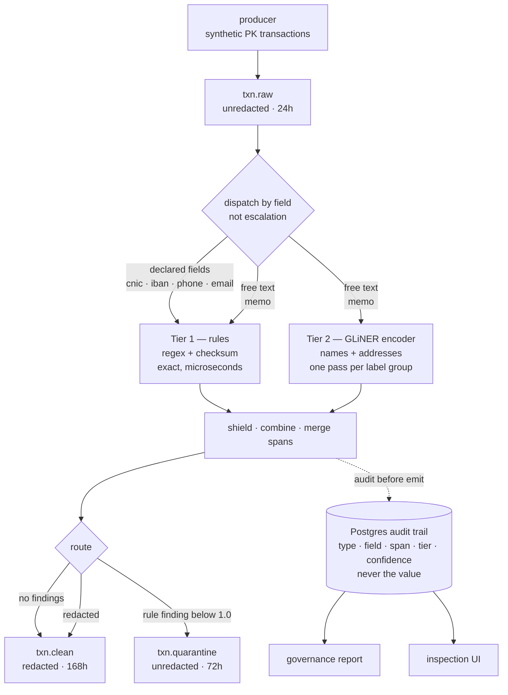
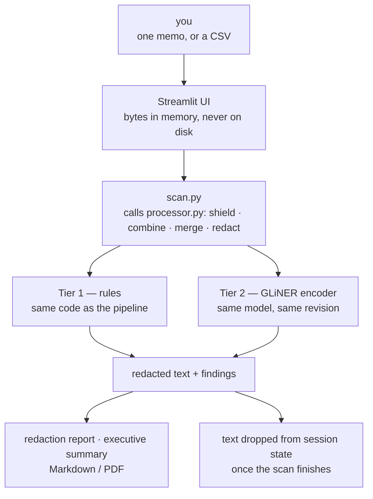

# PipelineGuard

**A streaming PII firewall for Kafka, with a Pakistani-locale focus.**

[](https://pipelineguard-g8rdu5ebpuxtq4bimlouyz.streamlit.app/)
[](pyproject.toml)
[](#tests)
[](docker-compose.yml)
[](db/init.sql)

### ▶ [Try it in your browser](https://pipelineguard-g8rdu5ebpuxtq4bimlouyz.streamlit.app/)

No install, no signup. Paste a memo and watch two detectors take it apart —
which tier caught what, at what confidence, over which characters.

[](https://pipelineguard-g8rdu5ebpuxtq4bimlouyz.streamlit.app/)

## What it does

Bank transaction records arrive on a Kafka topic. Some carry personal data —
sometimes in a declared field, sometimes buried in a free-text memo written in
a mix of English and Roman Urdu. PipelineGuard sits in the middle of that
stream and does three things:

- **Finds the personal data, two ways.** Rules match the things that have a
  format — CNIC, Pakistani IBAN with its mod-97 check, Pakistani phone, email.
  An encoder model reads the free text for the things that don't: names and
  addresses. A regex cannot find a name, which is why the second tier exists.
- **Redacts in stream, quarantines what it is unsure of.** Downstream consumers
  get `[CNIC]` instead of the number. A record whose rule check failed is held
  back for a person to look at rather than guessed at.
- **Writes an audit trail that is not itself a privacy problem.** Every decision
  is recorded — entity type, field, character span, tier, confidence. **Never
  the value.** The governance report is generated from that trail.

## What the measurements say

Numbers here are measured, not estimated, and the method and caveats for each
are written down. Nothing in this table is a projection.

| | |
|---|---|
| Throughput, Tier 1 at batch 512 | **1,267 rec/s** |
| What batching is worth | **~180×** over committing per message |
| Names Tier 1 found in free text | **0** — no rule can match a name |
| Names Tier 2 found in the same 2,000 records | **892** |
| Address coverage, 2,786 real OpenStreetMap addresses | **96.0%** |
| Encoder memory, bf16 vs fp32 | **845 MB** vs 1,780 MB, coverage unchanged |
| Test suite | **509 passing**, no broker or database needed |

Four encoder checkpoints were scored before one was picked, and the one
marketed for PII placed third — see [Model evaluation](#model-evaluation).
Both a locale fine-tune and an LLM third tier were measured and **declined**,
with the numbers that decided it — see [Fine-tune, or swap the
checkpoint?](#fine-tune-or-swap-the-checkpoint).

## Run it

```bash
# The pipeline — Kafka, the processor, a Postgres audit trail, a governance report
docker compose up -d

# Just the detectors — playground, batch file scan, exportable reports.
# No broker, no database, nothing written to disk.
streamlit run src/pipelineguard/ui.py --server.address localhost
```

Both run the same detection and redaction code; a test asserts the two agree.
Everything around it differs, so pick one — [Part 1](#part-1--the-pipeline) is
the pipeline, [Part 2](#part-2--the-inspection-ui-and-the-public-demo) is the
inspection UI and the hosted demo above.

---

## How it works

Raw events flow through a tiered detection pipeline; PII is redacted in-stream,
uncertain records are quarantined for review, and every decision is written to
a Postgres audit trail from which a governance report is generated.



The same flow in more detail, including the batching that makes Tier 2 pay for
itself:

```
  ┌────────────┐
  │  producer  │   synthetic PK bank transactions, ~40% with no memo
  └─────┬──────┘
        ▼
    txn.raw ─────────────────────────────────── 24h · UNREDACTED input
        │
        ▼
┌───────────────────────────────────────────────────────────────────────┐
│ processor                                    consume(batch ≤ 500)     │
│                                                                       │
│  ── batched, once per Kafka batch ─────────────────────────────────   │
│   A. collect non-empty free text          (best-effort, decides none) │
│   B. ONE encoder call, chunked at 8   ──────────────► GPU / CPU       │
│                                                                       │
│  ── per message: DISPATCH BY FIELD, not escalation ────────────────   │
│   account_holder  →  schema rule      whole field, confidence 1.0     │
│   memo            →  T1 rules  +  T2 encoder     (spans unioned)      │
│   cnic iban phone email → T1 rules    regex + checksum                │
│                                                                       │
│  ── route ─────────────────────────────────────────────────────────   │
│   no findings ─────────────────► clean                                │
│   T1 finding < 1.0 ────────────► quarantine   (original bytes)        │
│   otherwise ─── redact ────────► redacted                             │
│                                                                       │
│   T3 LLM for ambiguous spans …………………………………………………… planned            │
│                                                                       │
│  audit BEFORE emit          ·          commit offsets LAST            │
└──────┬──────────────────────────────────────────┬─────────────────────┘
       ▼                                          ▼
  txn.clean ── 168h · redacted        txn.quarantine ── 72h · UNREDACTED
       │                                          │
       └──────────────► Postgres audit ◄──────────┘
                        type · field · span · tier · confidence
                        never the value
                                 │
                                 ▼
                        governance report (Markdown)
```

**Tier 1 → Tier 2 is dispatch, not escalation.** Tier 1 has no name rule, so a
memo is not a record it was *uncertain* about — it is one it has no opinion on.
The schema already says which fields are free text, so the routing is fixed
before either detector runs. Tier 2 → Tier 3 will be genuine escalation: same
span, promoted on uncertainty.

> **Honest scope:** the input streams are synthetic (Faker + hand-built
> Pakistani-locale generators — CNIC, PK IBAN, Pakistani names in Latin
> script). No real PII is processed or stored; the *audit trail* records entity
> types and spans, never values — though `txn.raw` and `txn.quarantine` do carry
> unredacted payloads, which is why their retention is set explicitly.
> Delivery semantics are **at-least-once with idempotent audit writes** — see
> [Design decisions](#design-decisions) for why not exactly-once.


## Status

### Shipped

| | |
|---|---|
| **Infrastructure** | Docker Compose stack — Kafka 3.8 KRaft, Postgres 16, the processor as a service |
| **Stream** | Synthetic Pakistani bank transactions + producer, ~40% carrying no memo |
| **Tier 1** | Regex and checksum rules — CNIC, PK IBAN (mod-97), PK phone, email |
| **Tier 2** | Encoder NER over free text, batched, GPU-optional, pinned to one commit |
| **Processor** | consume → detect → redact → route → audit, micro-batched, audit before emit |
| **Schema redaction** | Declared PII fields (`account_holder`) masked whole from the schema |
| **Governance report** | Generated from the audit trail; technical and executive views |
| **Inspection UI** | Streamlit — playground, batch file scan, live audit-trail report |
| **Public demo** | Deployed on Streamlit Community Cloud, bf16 on CPU inside a 1 GB ceiling |
| **Tests** | 509 passing, 13 skipped; no broker or database required |

Two of these are worth calling out because they were only true after something
went wrong. **Tier 2 was verified against a live broker** (findings §24), which
found a leak that eleven sections of offline probing had missed. And **the
model pin is enforced at boot** by prefetching the exact commits then forbidding
the network — the demo host has no build step, so it had to happen in-process.

### Measured, and deliberately not built

Each of these was evaluated far enough to produce numbers, then declined. The
numbers are the point; the decision is downstream of them.

| | Why not | Where |
|---|---|---|
| **Tier 2 locale fine-tune** | The residual is positional, not semantic. Four times a missed address was blamed on the model and four times a span rule reached it — most recently for +2.6 points, where 0.3 would have ended the argument | §17, §18, §21, §23 |
| **Tier 3 LLM escalation** | 0.08% of records leak, and the cheapest trigger that catches them escalates 35.6% of the stream | §22 |
| **int8 quantisation** | Not a trade-off, a failure: coverage collapses to 7.6% / 4.9% and it does not even save memory | §27.5 |
| **Single-pass label groups** | Halves encoder cost, drops PERSON coverage to 90.9% — the labels compete for the same spans | §11.5 |

### Open

- [ ] Flagging records whose redaction left nothing — the mitigation for
      over-redaction destroying a memo whole
- [ ] End-to-end latency measurement; every figure here is detection-only
- [ ] Support-chat free-text topic
- [ ] Airflow batch-scan mode


---

# Part 1 — The pipeline

Kafka in, redacted Kafka out, with every decision written to Postgres. This is
the product. It needs Docker; it does not need the UI.

## Quick start

```bash
docker compose up -d          # everything: broker, database, topics, firewall, and 1,000 records
```

One command, no local Python. It brings up Kafka and Postgres, runs a one-shot
`topics-init` container to create the topics (broker auto-create is disabled),
starts the processor only once that container has *exited successfully* — so
"the topics probably exist by now" is an ordering guarantee rather than a hope
— and then feeds a bounded batch through it.

```bash
docker compose logs -f processor    # watch it work
```

The seed is deliberately bounded and one-shot. Change it, or turn it off once
the volume already holds data:

```bash
SEED_COUNT=5000 docker compose up -d      # a bigger batch
SEED_COUNT=0 docker compose up -d         # no new records
docker compose run --rm producer --rate 50 --count 200   # ad hoc, any time
```

```bash
docker compose run --rm report                             # governance report to stdout
docker compose up -d --scale processor=3                   # three consumers, one per partition
```

### Demonstrating crash-and-replay

The [failure taxonomy](#design-decisions) below claims that an infrastructure
failure crashes the process and replays on restart. `restart: unless-stopped`
on the processor is what makes that real rather than asserted, and it can be
watched:

```bash
docker compose stop postgres                               # infrastructure fails
docker compose run --rm producer --rate 0 --count 500      # keep feeding it anyway
docker compose logs processor | grep OperationalError      # crashing, not swallowing
docker compose start postgres                              # infrastructure returns
```

The processor dies on the audit write, restarts, dies again, and keeps cycling
until Postgres answers — then drains the backlog. Measured over exactly that
sequence: 5 restarts while down, and afterwards **2,500 audit rows for 2,500
produced messages — no loss and no duplication**, with consumer lag back to
zero. Uncommitted offsets are what prevent the loss; the idempotent audit
upsert is what prevents the duplication.

Note that `docker kill` on the container will *not* trigger a restart — Docker
treats an explicit kill as a manual stop. The behaviour above is about the
process exiting, which is the case the design is actually about.

<details>
<summary>Running on the host instead</summary>

```bash
docker compose up -d kafka postgres
pip install -e .                                           # src layout: editable install puts pipelineguard on the path
python scripts/create_topics.py
python -m pipelineguard.producer --rate 50 --count 1000
python -m pipelineguard.processor
```

The host defaults in `config.py` point at `localhost:9092` and `localhost:5433`;
the compose services override them to `kafka:19092` and `postgres:5432`. `.env`
is excluded from the image so it cannot reinstate host values inside a
container.
</details>

Inspect results:

```sql
SELECT action, count(*) FROM messages_processed GROUP BY action;
SELECT entity_type, tier, count(*) FROM findings GROUP BY 1, 2 ORDER BY 3 DESC;
-- why were records quarantined without findings?
SELECT failure_class, count(*) FROM messages_processed
 WHERE failure_class IS NOT NULL GROUP BY failure_class;
```

> Postgres is published on host port **5433** (5432 is commonly taken by a
> native install). The container still listens on 5432 internally.

### Governance report

```bash
python -m pipelineguard.report                              # Markdown to stdout
python -m pipelineguard.report --since 2026-07-01 --output report.md
```

Written for a compliance reviewer: what personal data flowed through, over
what period, what was done about it, and what needs a human. It reads the
audit trail and nothing else — no Kafka, no message payloads — so it cannot
disclose a value the audit trail declined to store. A generated example is
committed at [docs/sample-report.md](docs/sample-report.md).

Its two quarantine queues are deliberately separate: **failed closed** are
deterministic defects that will fail identically on replay and need an
engineering fix, while **uncertain** records are judgements the pipeline
declined to make and need a person. Section 9 states what the report *cannot*
show — chiefly that it describes what entered the pipeline, not what existed,
which is a question about consumer lag that no audit table can answer.

| flag | default | purpose |
|---|---|---|
| `--since` / `--until` | unbounded | ISO-8601 window on `processed_ts`, half-open `[since, until)` so adjacent reports partition exactly |
| `--max-queue` | 50 | max review items listed per queue; totals are counted independently, so truncation is always disclosed |
| `--output` | stdout | write to a file instead |

### Processor flags

| flag | default | purpose |
|---|---|---|
| `--batch-size` | 500 | max messages per `consume()` call — see [Benchmarks](#benchmarks) for why |
| `--batch-timeout-ms` | 1000 | how long to wait for a batch to fill before processing what arrived |
| `--flush-timeout` | 10 | seconds to wait for a batch's produces to be confirmed durable |
| `--stats-every` | 5 | seconds between throughput/latency stats lines |
| `--exit-after` | 0 | stop after N messages (0 = run until interrupted); makes benchmark runs reproducible |
| `--log-level` | INFO | `DEBUG` logs every message — never use it while benchmarking |


## Tier 2 — the encoder

Tier 1 cannot find a name. No rule can: a name has no format to match. That is
the whole reason Tier 2 exists — **capability, not cost.** Before it, a memo
reading `Transfer to Ayesha Malik` reached the clean topic verbatim, and so did
`account_holder`, because Tier 1 produced no findings on either.

Measured on 2,000 records ([full findings](docs/tier2-detection-findings.md)):

| | Tier 1 only | + Tier 2 (GPU) |
|---|---:|---:|
| throughput | 439 rec/s | **159 rec/s** |
| p50 detection | 0.09 ms | 6.43 ms |
| names found in `memo` | **0** | **892** |

`gliner-community/gliner_medium-v2.5`, **pinned to revision `88c3b98b`**, at
threshold 0.55. On the generated stream: **PERSON 100.0%, ADDRESS 100.0%**
character coverage. On 2,786 real OSM addresses: **96.0%**. Five results worth
knowing before changing anything:

- **The threshold is not a probability.** It is an uncalibrated sigmoid cutoff
  and does not transfer between checkpoints — `nvidia/gliner-PII` at this
  model's 0.25 fires on 68% of clean Pakistani text. Swapping `TIER2_MODEL`
  means re-running `scripts/probe_ner_sweep.py`; the detector logs a warning if
  you don't.
- **Labels are run one group per forward pass.** Folding them into a single
  pass halves the cost and drops PERSON coverage to 90.9% — the labels compete
  for the same spans.
- **Batching is the whole speedup.** 7.2 ms/record at batch 8 against 29.4 at
  batch 1, which is why inference happens in `main()` and findings are injected
  into `process_message` rather than detected there.
- **ADDRESS was removed, then restored** (findings §18). It was dropped when
  nothing in the stream contained an address; the generator now emits them, and
  the ADDRESS labels cost one extra forward pass and **0.0% incremental
  over-redaction** — the characters they claim were already claimed by PERSON.
- **The residual is positional, not semantic.** Four times a missed address was
  blamed on the model and four times a span rule reached it: separators,
  the house number, the component behind `Block J`, and the hole between two
  spans (§17, §18, §21, §23). That is why there is no fine-tune.

Off by default. Enable with `TIER2_ENABLED=true`, `TIER2_DEVICE=cuda|cpu|auto`.
In Docker it is opt-in at build time too, because torch and gliner add ~1.5 GB:
`INSTALL_TIER2=true docker compose build processor`.

**Pin the model, then stop talking to HuggingFace.** A load touches two repos:
the checkpoint, and the backbone config GLiNER resolves at `main` with no
revision it will accept (findings §25). Both are pinned by prefetching the exact
commits and then forbidding the network:

```bash
python -m pipelineguard.prefetch                    # once, with network
$env:HF_HUB_OFFLINE=1                               # PowerShell; export on POSIX
```

After that every run — pipeline or `try_redaction.py` — loads from disk with
**zero** requests to huggingface.co. `load()` logs which state it is in
(`backbone config PINNED` / `UNPINNED`), and `scripts/verify_tier2_pin.py`
checks both halves. Docker keeps its own cache in the `models` volume, so warm
it separately: `docker compose run --rm processor python -m pipelineguard.prefetch`.

**Try it on your own text** — same detectors, same rewrite as the pipeline:

```bash
python scripts/try_redaction.py "Transfer to Ayesha Malik, CNIC 42101-1234567-8"
python scripts/try_redaction.py --tier2 "Statement Plot E-379, Airport Road, Quetta par bhej dein"
python scripts/try_redaction.py --tier2          # interactive
```

It prints the redacted output, every finding with its tier and confidence, and
how the overlapping spans merge. Without `--tier2` you get the rules only, which
match formats — a name or address in free text needs the encoder.

## Model evaluation

Four encoders were scored on the same cases before one was picked. Character
coverage — the fraction of a gold span's characters the model claims — not
classic recall, because a half-redacted address is a leak and precision/recall
scores it as a hit.

| model | licence | PERSON | ADDRESS |
|---|---|---:|---:|
| [**gliner-community/gliner_medium-v2.5**](https://huggingface.co/gliner-community/gliner_medium-v2.5) | Apache-2.0 | **100.0%** | **86.5%** |
| [urchade/gliner_multi_pii-v1](https://huggingface.co/urchade/gliner_multi_pii-v1) | Apache-2.0 | 99.4% | 75.3% |
| [nvidia/gliner-PII](https://huggingface.co/nvidia/gliner-PII) | NVIDIA OM | 91.1% | 74.7% |
| [FacebookAI/xlm-roberta-large-…-conll03](https://huggingface.co/FacebookAI/xlm-roberta-large-finetuned-conll03-english) | MIT | 93.8% | 52.3% |

PERSON is 165 synthetic name cases; ADDRESS is **91,663 real addresses across
eight Pakistani cities**, fetched from OpenStreetMap via Overpass. Names stay
synthetic because `decisions.md` §1 forbids processing real personal data, so
those numbers are comparable to the tuning set rather than independent of it —
a real limit on what the PERSON column proves (findings §15).

Three things this table hides, and each of them changed a decision:

- **The name a model is marketed under predicts nothing.** `nvidia/gliner-PII`
  is the one built for PII and it placed third on both axes. The general-purpose
  community checkpoint won.
- **A checkpoint swap beat fine-tuning.** The gap between first and last here is
  34 points of ADDRESS coverage. No fine-tune was attempted, because the
  remaining residual turned out to be positional — separators, house numbers,
  trailing cities — and four span rules reached it (findings §17, §18, §21, §23).
- **The comparison is only valid per checkpoint at its own threshold.** The
  cutoff is an uncalibrated sigmoid output, not a probability. Scoring every
  model at one shared number measures the number, not the models.

A fifth was measured for the demo host: [`gliner_small-v2.5`](https://huggingface.co/gliner-community/gliner_small-v2.5)
costs 0.6 points of complete PERSON redaction and nothing on ADDRESS, for 1.7×
the speed and 324 MB less memory. Not shipped in the pipeline, which has the
memory; kept as the fallback if the demo host cannot hold `medium`.


## Fine-tune, or swap the checkpoint?

The obvious move, once ADDRESS coverage stalled, was to fine-tune on Pakistani
addresses. It was proposed four times and declined four times. This section is
the reasoning, because the decision is only defensible if the argument for the
other side is written down too.

**The case for fine-tuning was real.** ADDRESS sat twenty points below PERSON on
an entity type that is equally identifying. The residual sat in the identifying
part — the models nearly always found the city and missed the house number, so
a partly-redacted address *looked* redacted and was not. A corpus existed:
91,675 real addresses with independent provenance. And a Pakistani-locale
address model is the one thing here that cannot be had by picking a better
checkpoint.

**What decided it against was measurement, repeated.**

> Every time an address failure was attributed to the model and then measured,
> it turned out to be somewhere a rule could reach. §17 found separators. §18
> found the house number. §21 found the component behind the structural word.
> §23 found the hole between two spans. **Four for four.**

The stopping condition was written in advance to be falsifiable: if a further
span rule gained under 0.3 points, the easy ground was gone and the rest was
genuinely the model. It did not fire — the next rule gained **2.6 points**, and
moved the ADDRESS bar from 93.3% to 96.0%. A fine-tune now has to clear a
materially higher number to win.

### The trade-offs, on both axes

A fine-tune is an ML decision with data-engineering consequences, and the
consequences are what actually killed it.

| | Fine-tune | Checkpoint swap + span rules (**shipped**) |
|---|---|---|
| **Coverage** | Unknown until trained | 34 points of ADDRESS separated best candidate from worst — all four measured before committing to one |
| **Cost to get there** | A rented GPU, 208M parameters | 11% more compute, zero training |
| **Evaluation** | Corpus is 83% Karachi — a model trained on it learns Karachi conventions and is then scored on them | Held out by construction; the swap was scored on 91,663 addresses across eight cities |
| **Reproducibility** | A weights artifact to store, version and ship | One commit SHA, pinned and verifiable offline |
| **Failure mode** | Silent. A regression shows up as slightly worse coverage on text nobody is looking at | Loud. A span rule is a function with a unit test |
| **Who can change it** | Whoever can run training | Anyone who can read a regex |
| **Precision** | Unmeasured — and precision is where the last three reversals came from | Measured at each model's own threshold |
| **Reversibility** | Retrain to undo | Change one environment variable |

Three of those rows are data-engineering rows, not ML rows, and they are the
ones that settled it. **A pinned checkpoint is an artifact the pipeline can
verify** — `prefetch` warms the exact commits, the process then goes offline,
and `verify_tier2_pin.py` checks both halves. A fine-tuned checkpoint is an
artifact somebody has to host, version and trust. That is a supply chain where
there was none.

**The same reasoning killed Tier 3.** An LLM escalation tier was costed the same
way: 0.08% of records leak, the cheapest trigger that reaches them escalates
35.6% of the stream, and the leaking population is 0.25% of records. Paying a
per-token cost on a third of the traffic to fix a quarter of a percent is not a
trade — see findings §22.

**And the same reasoning ran the other way for batching.** Where measurement
showed the architecture *was* the bottleneck, the complexity was bought without
hesitation: micro-batching is worth ~180× and detection turned out to be ~15% of
per-record time. The rule is not "prefer the simple thing". It is **measure
where the cost actually is, then spend there** — which pointed at the plumbing
for throughput and at span rules for coverage, and at a training loop for
neither.

### What would reopen it

Written down so this can be revisited on evidence rather than mood:

1. **The residual stops being positional** — a further span rule gains under
   0.3 points.
2. **Addresses enter the pipeline as a real declared field**, rather than only
   appearing inside free text.
3. **A genuinely held-out evaluation set exists** — ideally a city the model
   never trained on, not a random split of a corpus that is 83% one city.

Full reasoning and the numbers behind every line above:
[findings §16, §21, §22, §23](docs/tier2-detection-findings.md).


## Weight precision — fp32, bf16, fp16, int8

The checkpoint ships fp32, fp16 and bf16 weights in the same commit, so the
precision is a deployment choice rather than a different model — the pin still
holds. Measured on CPU torch in a Linux container, 50 memos per pass
(findings §27.5, `scripts/probe_model_footprint.py`):

| weights | resting RAM | peak | ms/record | PERSON | ADDRESS |
|---|---:|---:|---:|---:|---:|
| `medium` fp32 — the pipeline | 1,780 MB | 1,790 MB | 94 | 99.4% | 100.0% |
| **`medium` bf16 — the demo** | **845 MB** | **858 MB** | 225 | 99.4% | 100.0% |
| `small` fp32 | 1,456 MB | 1,461 MB | 55 | 99.3% | 100.0% |
| `small` bf16 | 735 MB | 768 MB | 142 | 99.3% | 100.0% |
| `small` fp16 | 741 MB | 752 MB | 296 | 99.3% | 100.0% |
| `small` int8 | 1,569 MB | 1,574 MB | **26** | **7.6%** | **4.9%** |

- **bf16 halves the memory and costs nothing measurable in coverage.** Both
  entity types score identically to fp32 to one decimal place. The price is
  ~2.5× latency: CPUs do fp32 natively and convert bf16 on the fly.
- **fp16 is strictly dominated.** Same memory as bf16, twice the latency again.
  There is no configuration here where it is the right choice.
- **int8 is not a trade-off, it is a failure.** Coverage collapses to 7.6% and
  4.9%, and it does not even save memory — torchao's dynamic path holds the fp32
  weights alongside the quantized ones. Fast and useless. It is in the table
  because it was measured and rejected, not because it is an option.

`TIER2_VARIANT=bf16` selects it; empty means fp32, which is what the pipeline
runs. `low_cpu_mem_usage` is set alongside it, or torch materialises a
full-precision copy while loading and the peak erases the saving.


## Observability

The producer shows a progress bar (bounded work). The processor consumes an
unbounded stream, so it emits a periodic stats line instead — which doubles as
the source of the benchmark numbers below:

```
12:04:31 INFO    pipelineguard.processor  processed=12,480 clean=0 redacted=11,982
                 quarantined=495 failed=3 | rate=842/s p50=1.10ms p95=2.40ms p99=6.80ms
```

Per-message logging is DEBUG-only by design: at the rates this pipeline
reaches, logging every message makes stdout the bottleneck and the benchmark
measures the terminal rather than the pipeline.


## Benchmarks

Batch size sweep, 20,000 synthetic transactions per run. Every run reprocesses
the same messages from offset 0 under a fresh consumer group.

| `--batch-size` | throughput | per-record | detection p50 / p95 / p99 |
|---:|---:|---:|---:|
| 1 | 8 /s | 125 ms | 0.28 / 0.50 / 0.64 ms |
| 8 | 57 /s | 17.5 ms | 0.14 / 0.35 / 0.50 ms |
| 32 | 291 /s | 3.44 ms | 0.10 / 0.19 / 0.26 ms |
| 64 | 368 /s | 2.72 ms | 0.10 / 0.18 / 0.26 ms |
| 128 | 892 /s | 1.12 ms | 0.10 / 0.15 / 0.22 ms |
| 256 | 898 /s | 1.11 ms | 0.11 / 0.18 / 0.23 ms |
| **512** | **1,267 /s** | **0.79 ms** | 0.10 / 0.16 / 0.21 ms |
| 1024 | 1,361 /s | 0.735 ms | 0.10 / 0.13 / 0.19 ms |
| 2048 | 1,450 /s | 0.69 ms | 0.11 / 0.15 / 0.20 ms |

**Batching is worth ~180× on this workload** — 8 msg/s committing per message,
1,450 msg/s at a 2048-message batch. That is the entire justification for the
added complexity, and it comes from amortising three fixed costs (a Postgres
WAL fsync, a producer flush waiting on broker acknowledgement, and an offset
commit round trip) across N records instead of paying them per record.

**512 is the default because the curve flattens there.** It reaches 87% of the
best observed throughput; 1024 buys 7 more points for double the replay window
and 2048 another 6 for quadruple. Since a failed batch replays in full, batch
size is bought with replay cost, and the marginal return collapses past 512.

**Detection is not the bottleneck, and that is the interesting result.** p50
detection latency sat at 0.10–0.11 ms in every configuration across both
sweeps — nine runs, two orderings — while per-record cost at the best batch
size is 0.69 ms. **Roughly 85% of per-record time is spent somewhere other
than detection**: producing, auditing, and moving bytes across the broker and
database boundaries. Tier 1's rules are effectively free relative to the
plumbing around them, which is worth knowing before Tier 2 adds ~20 ms of
model inference to that budget.

### Methodology and caveats

Hardware: Intel i7-11800H (8 cores / 16 threads), 31.7 GB RAM, Windows +
Docker Desktop (WSL2 backend, 16 CPUs / 15.5 GB allocated). **Kafka, Postgres
and the processor all ran on the same laptop**, so these are relative
comparisons between configurations, not absolute capacity claims — a
dedicated broker over a real network would look different in both directions.

Message shape: 9-field synthetic bank transaction, ~500 bytes, averaging 5.4
detected entities each (2 IBAN, 1.2 phone, 1.1 email, 1.1 CNIC). The producer
ran unthrottled (`--rate 0`) so that batch size, not arrival rate, was the
binding constraint — throttling below `batch_size / batch_timeout` would close
batches on the clock and flatten the curve for the wrong reason.

Runs used `--exit-after 20000` for a deterministic stopping point; timing a
long-running consumer by hand biases the rate downward by however long it
idles after draining. The audit tables were truncated between runs.

**The latency columns measure detection only.** The timer starts immediately
before `process_message` and stops after it, so consume, batch linger, audit,
produce and flush are all excluded. End-to-end latency is not yet measured.

**Low-batch-size numbers are not stable on this hardware.** The sweep was run
twice, forward and in reverse. Results at 256 and above agreed within 4%, but
`--batch-size 128` measured 307 /s in the forward sweep and 892 /s in reverse —
2.9× apart. In the forward run its throughput degraded monotonically within
the run (586 → 431 → 327 → … → 174 /s); in reverse it held steady at ~1,050 /s.
The forward sweep had spent ~47 minutes under sustained load before reaching
that point, the reverse sweep 70 seconds.

Two hypotheses were tested by re-running the sweep in reverse order. Index
growth in `findings` was ruled out — the table grows identically within every
run, including the reverse one that showed no degradation. The remaining
explanation is the measurement environment: a laptop running all three
components, where sustained load degrades over tens of minutes. The reverse
sweep is reported above because it completed in 3.6 minutes with flat interval
rates throughout. The anomaly is documented rather than smoothed away, and it
does not affect the design conclusion.

Correctness held across every run: 19,227 redacted and 773 quarantined of
20,000 (3.87% quarantine rate, against 3.96% predicted from the generator's
2%-per-IBAN corruption and two IBANs per message), zero fail-closed failures,
and exactly 40,000 IBAN detections — precisely two per message.


---

# Part 2 — The inspection UI and the public demo

A way to watch the same detectors work on text you choose. It runs the code
Part 1 runs — `scan.py` calls `processor.redact` rather than reimplementing it,
and a test asserts the two agree — but there is no broker behind it, no audit
database, and nothing is written to disk.



Everything Part 1 has and this does not: `txn.raw`, `txn.quarantine`,
`txn.clean`, the `messages_processed` and `findings` tables, offset commits,
crash-and-replay. A report produced here says so — see
[Design decisions](#design-decisions), *"A report says which of the two systems
produced it"*.

## The inspection UI

A local Streamlit app over the same detectors. Three tabs: scan one memo, scan
an uploaded CSV or TXT, and render the governance report from the audit trail.

```bash
pip install -e ".[ui]"                 # into an env that already has [tier2]
HF_HUB_OFFLINE=1 python -m streamlit run src/pipelineguard/ui.py \
    --server.address localhost
```

Run it from the repo root, which is where Streamlit reads
`.streamlit/config.toml`. Install `[ui]` on its own rather than `.[tier2,ui]`:
resolving `torch>=2.13` again can replace a working CUDA build with the CPU
wheel from PyPI.

**Local only.** `--server.address localhost` is part of the command, not
decoration: without it Streamlit binds every interface and advertises a LAN URL.
It is in the command rather than in `.streamlit/config.toml` because a hosted
build reads that file from the same working directory, and an app bound to
loopback can be unreachable through a platform's proxy. The hosted demo is the
deliberate exception either way — see [The public demo](#the-public-demo).

| Tab | What it does |
|---|---|
| Playground | One memo. Highlighted spans, the redacted output, and every finding with its tier, confidence and regulatory category |
| Batch scan | Up to 500 rows (~8 s at the measured 16 ms/row). Two exports of the same scan: the redaction report (technical, every row) and the executive summary (governance view), each as Markdown or PDF |
| Governance report | `report.fetch()` + `report.render_summary()` against Postgres — the three-page summary view. `python -m pipelineguard.report` still writes the full technical version |

On a cold start the encoder loads on a background thread, so Tier 1 rules are
usable within a second or two while it does. Every Tier 2 control stays
disabled until the encoder answers — a live threshold slider over a model that
has not loaded promises something the app cannot do.

The sidebar toggles the encoder, selects entity types per tier, moves the
confidence threshold, and turns the address span widener on and off. The
threshold and the widener are applied to the detector and the text re-scanned,
not filtered afterwards: address spans are bridged during detection and a
bridge keeps the highest score of the spans it joins, so a post-hoc filter
would show spans the pipeline never produces.

**What the batch export is not.** It is a scan of a file, and both documents say
so on every page. `ReportData.source` names the upload instead of the audit
trail, and `from_stream=False` swaps the passages that would otherwise assert
at-least-once delivery, a `txn.quarantine` review queue and an audit trail that
recorded the run — none of which exist for a CSV. The compliance passages stay,
because the scan runs the same detectors, but they are introduced as a
description of the pipeline rather than of the scan. Neither report is called
"audit cleared", because `compliance.py` states the report is not a compliance
determination. The exported rows are redacted output only; original text and
matched values never leave the playground tab. Address redaction is routinely
incomplete rather than binary, and the report carries that caveat beside the
rows.

**Over-redaction is the accepted cost.** At this threshold ~38% of clean
Roman-Urdu memos fire, and some are destroyed whole (`Zakat contribution` →
`[ADDRESS+PERSON_NAME] contribution`, scoring 0.89 as a name and 0.84 as an
address). Coverage was deliberately not traded away to fix it, and the false
positives score up to 0.98 — high enough that no threshold change removes them.
Flagging fully-saturated redactions is the open mitigation.


## The public demo

**[pipelineguard-g8rdu5ebpuxtq4bimlouyz.streamlit.app](https://pipelineguard-g8rdu5ebpuxtq4bimlouyz.streamlit.app/)**
— live on **Streamlit Community Cloud**.

It is a different build, not the same one exposed: `PG_DEMO=1` changes five
things, and they are the difference between "local tool" and "thing strangers
can reach":

| | local | demo |
|---|---|---|
| Batch cap | 500 rows | **50** — bf16 on CPU is ~225 ms/row and scans serialise |
| Encoder precision | fp32 | **bf16** — 845 MB instead of 1,780, same coverage |
| Threshold slider | shown | **removed** — any override takes the global lock, so leaving it alone lets visitors scan concurrently |
| Span-widener toggle | shown | removed, same reason |
| Governance tab | live Postgres | a stored run, `docs/sample-summary.md`, stamped as an example in the file itself |
| Privacy notice | not shown | shown on the welcome screen and the batch tab |

The stamp on the stored report matters more than it looks. The tab explains
that it is an example over 5,000 synthetic records, but a downloaded PDF is
read later and out of context, by someone who never saw the tab.
`report.stamp_example()` marks the title, the source line and puts a banner
above the first figure, so the file carries its own provenance. The banner names
this repository and the script that generated it, and says to cite the
repository rather than the document — a reader holding only the PDF otherwise
has a governance report with no way to check a figure or attribute it.

**The report about your own upload is in Batch scan**, not here. That one is
built from the rows you submitted; this one is a recording of the pipeline.

**Nothing uploaded is retained.** Streamlit hands the file over as bytes in
memory; the UI writes nothing to disk and nothing to the audit database. After
a scan the rows are dropped from session state by `ScanResult.without_text()`,
which keeps every figure already computed and discards the text. A test asserts
the original cannot survive it.

### Where it runs, and why there

Hugging Face was the plan. Its Docker and Gradio SDKs now require a paid PRO
account, so the free path there is gone and **Streamlit Community Cloud** is
where it runs. Full instructions:
[`deploy/streamlit-cloud/README.md`](deploy/streamlit-cloud/README.md).

```
Repository       AffanBasra/PipelineGuard
Main file path   deploy/streamlit-cloud/app.py
Advanced         nothing — app.py carries the whole configuration
```

That host costs two things.

**A 1 GB memory ceiling**, which the shipped fp32 checkpoint misses by 766 MB.
The bf16 weights in the same commit fit at 845 MB resting, with coverage
unchanged — see [Weight precision](#weight-precision--fp32-bf16-fp16-int8).
Add ~96 MB for Streamlit, pandas and Arrow and the total is ~950 MB against
~1,024. **That is 70 MB of headroom and it is thin.**

It survived the two heaviest things a visitor can do, checked against the live
app after deploy: a full 50-row batch (10–12 s, no restart) and a paste long
enough to hit the 1,000-character cut. Cold boot — clone, install, prefetch,
load — took 59 s. That is evidence the ceiling holds for this workload, not
proof it holds for every one. If it does start hitting resource limits the
fallback is `gliner_small-v2.5` in bf16, which leaves 160 MB — a different
checkpoint, so its threshold has to be re-swept before it can be trusted.

**No build step.** Community Cloud installs a requirements file and runs one
script, so the pin cannot be warmed at build time. GLiNER resolves its backbone
config at `main` and accepts no revision, so the only way to pin it is to warm
the cache with the right commit and then forbid the network (findings §25).
`deploy/streamlit-cloud/app.py` does both at boot instead: prefetch, then
`prefetch.go_offline()`, before anything imports huggingface_hub — which reads
the offline flag into a module constant at import time, so the environment
variable alone is too late. If the prefetch fails the app runs online and
**unpinned**, and says so on the page and in the sidebar rather than dying.

The boot download is ~415 MB, not the repo's 1.6 GB, because the checkpoint
carries fp32, fp16 and bf16 side by side and this build reads one of them.

### The container build

Still supported, and the better option on any Docker host with more than 1 GB:
it bakes the weights into the image, needs no boot-time download, and runs fp32.

```bash
docker build -f deploy/hf-space/Dockerfile -t pipelineguard-demo .
docker run --rm -p 7860:7860 pipelineguard-demo
```

`deploy/hf-space/README.md` is the Space card, for a Docker host that wants one.

### What it costs a visitor

| | Streamlit Cloud (bf16) | container (fp32) |
|---|---|---|
| First load after idle | 40–60 s: wake plus a ~20 s encoder load | 30–50 s |
| Playground scan | ~0.2 s once warm | ~0.1 s |
| Full batch | 50 rows, ~11 s, others queue | 100 rows, ~10 s |
| Memory | ~950 MB against ~1,024 | ~1.9 GB |

Tier 1 answers while the encoder is still loading, so the page is useful before
it finishes.

### Keeping it awake

Both hosts sleep when idle, and the wake plus encoder load is the first row
above. An uptime monitor pinging the app URL on a schedule keeps it warm, at the
cost of holding free compute you are not using. Point it at the root; any 200
counts.

### Regenerating the stored report

```bash
docker compose up -d
venv/Scripts/python.exe scripts/make_sample_summary.py
```


---

# Both parts

## Design decisions

**Tiered detection under a latency budget.** Tier 1 (compiled regex +
checksum validation, µs) handles structured PII; Tier 2 (a pinned off-the-shelf
encoder plus positional span rules, ms) handles names and addresses in free
text. A third LLM tier was
specified and then **declined on measurement** -- 0.08% of records leak after
both tiers, and the cheapest confidence trigger escalates 35.6% of the stream
to reach them (findings §22, §23). The
tiering is a throughput/cost tradeoff, not just an accuracy ladder — the
benchmark table [below](#benchmarks) quantifies it — and shows detection is
currently only ~15% of per-record cost, so the plumbing dominates the rules.

**At-least-once, not exactly-once.** Kafka transactions can make the
consume→produce→commit leg exactly-once, but this pipeline's outputs cross a
transaction boundary into Postgres, which Kafka cannot roll back. Rather than
claim EOS with a caveat, the pipeline commits offsets only after produce +
audit are durable, and the audit writer upserts on `message_id` — so
redelivery is harmless. Enabling transactions on the Kafka→Kafka leg is a
documented stretch item.

Offsets are committed asynchronously on purpose: safety comes from idempotent
audit upserts, not from commit synchrony, and a synchronous commit would add a
group-coordinator round trip (~ms) to a per-message budget measured in
microseconds. A commit is issued only after `flush()` has drained *and* the
per-message delivery callback reported no error — both checks are required,
since a message can leave the producer queue by failing.

**Three failure classes, handled differently.** Conflating message-level and
infrastructure failures yields either an infinite crash loop or silent loss;
conflating either with routine coordination events does the same in a
narrower way:

| failure | nature | response |
|---|---|---|
| unparseable bytes, wrong payload shape, detector raised | deterministic — fails identically on replay | **fail closed**: quarantine with the reason recorded, commit, continue |
| broker unreachable, Postgres down, delivery unconfirmed | transient — likely succeeds on replay | **crash and replay**: don't commit, let the process die, restart replays |
| commit rejected because the consumer group rebalanced under it (`ILLEGAL_GENERATION`, `UNKNOWN_MEMBER_ID`, `REBALANCE_IN_PROGRESS`) | routine — not a sign the coordinator is unreachable | **tolerated**: log and move on, uncommitted; the new partition owner reprocesses the batch, harmlessly, via the same idempotent audit upsert |

The dividing line for the first two is literal: message-level work sits
inside `process_message()`'s try block; everything after it in the loop is
infrastructure and is allowed to propagate. The third is narrower still — it
wraps only the `consumer.commit()` call, and only that exact, enumerated set
of codes. Deliberately **not** tolerated: `_MAX_POLL_EXCEEDED` means *we* were
too slow and should be loud, not silenced; `UNKNOWN_TOPIC_OR_PART` is a
deployment error; auth and coordinator failures are genuine infrastructure. A
blanket `except KafkaException` would convert all of those into silent loss —
exactly the failure mode this taxonomy exists to prevent.

**Batching widens the replay window from 1 message to N.** Offsets are now
committed once per batch (up to `--batch-size` messages, or whenever
`--batch-timeout-ms` expires) instead of once per message. A crash between
processing a batch and committing it therefore replays the whole batch on
restart — still at-least-once, still safe because the audit upserts, but the
amount of repeated work on failure now scales with batch size. This is the
honest price of the throughput win.

Error entries from `consume()` (broker notices — rebalance, EOF) are filtered
out before offsets are ever computed from a batch: they carry a topic,
partition and offset but no payload, and letting one through would silently
advance the commit position past a record that was never processed — the one
failure mode in the whole pipeline that loses data permanently rather than
just repeating work.

**Audit before emit.** The audit row is written *before* the message is
produced downstream, so no record is ever emitted that has not already been
recorded. A Postgres outage halts the pipeline rather than letting unlogged
data through — the correct posture for a governance tool.

**Audit trail stores no PII, but does store why.** `findings` records entity
type, field, span, tier and confidence — never the matched value.
`messages_processed.failure_class` / `failure_detail` explain fail-closed
quarantines, so "why was this quarantined" is answerable from SQL alone.

**The topics are a different story, deliberately.** That property belongs to the
audit database, not the system. `txn.raw` carries unredacted input by
definition, and `txn.quarantine` carries the *original* bytes on purpose — a
reviewer has to see what actually arrived. So the highest-risk store in the
system is the one nobody thinks of as a store. Retention is therefore set as a
data-protection control rather than a capacity one, in `scripts/create_topics.py`:

| topic | contents | retention |
|---|---|---|
| `txn.raw` | unredacted input | **24h** — enough to replay a day-long outage |
| `txn.clean` | redacted | 168h |
| `txn.quarantine` | **unredacted originals** | **72h** — this value *is* the reviewer SLA |

Shortening quarantine retention cuts exposure and raises the chance a record
expires unreviewed; that tradeoff is the reason the number is explicit rather
than inherited. The compose stack runs PLAINTEXT with no ACLs, which is normal
for local development and **is not a production posture** — transport security
and authorization are deployment concerns this repo does not configure.

**Quarantine policy.** Confident detections are redacted in place and
forwarded; only *uncertain* records (sub-threshold confidence, malformed
messages) are quarantined — mirroring how production DLP systems avoid
blocking the happy path.

The decisions above are the highlights; for the reasoning behind every
non-obvious choice in the project — including provisional values still
pending measurement and open questions not yet decided — see
[docs/decisions.md](docs/decisions.md).


## Tests

```bash
pip install -e ".[dev]"
pytest                      # no Kafka or Postgres needed
pytest -m integration       # the report's SQL, against a real Postgres
pytest --cov=pipelineguard  # coverage report
```

The detection and routing logic is written as pure functions — `RulesDetector.detect`,
`processor.process_message`, `processor.redact` — specifically so it can be tested
without infrastructure. Kafka messages are stubbed; Postgres is replaced by a fake
connection that records the SQL it was handed, which is how the audit tests assert
that **no payload value ever reaches the database**.

Coverage is 100% on the detection, routing, audit and generator modules, and
99% on `processor.py` — including its `main()` loop, tested by patching
`Consumer`/`Producer`/`AuditWriter` on the module with in-memory fakes rather
than running against a real broker. That proves the wiring (batching, error
filtering, commit ordering, rebalance tolerance); it is not a substitute for
integration testing against a live stack, which this suite doesn't attempt.
`producer.py`'s loop is untested for the same broker-bound reason — that gap
is real and not yet filled.

**The governance report is the one place that reasoning doesn't hold.** Its
logic *is* its SQL — the `GROUP BY`s, the window boundaries, the join that
distinguishes a quarantined record with no findings from one with several.
Handing canned rows to a fake connection would have tested the renderer
formatting its own fixtures while every query stayed unexercised and the suite
went green. So the report is split: rendering and classification are pure
functions tested offline, and the queries are tested against a real Postgres
in `tests/integration/`, skipped automatically when no database is reachable.
Each of those tests targets a specific way a query could be wrong and still
look right, and all six mutations tried against them — inclusive upper bound,
inner join for the uncertain queue, `avg` for `min` confidence, non-`DISTINCT`
record counts, a queue total collapsed to its capped listing, and silently
dropped unclassified entity types — were caught by exactly the intended test.


## Project layout

`[1]` Part 1 only · `[2]` Part 2 only · `[=]` shared by both. The shared column
is the point: the UI is worth showing because it runs the pipeline's code, not
a copy of it.

```
[1] Dockerfile                       one image, four entry points (processor, topics, producer, report)
[1] docker-compose.yml               broker, database, topic init, processor, seed, on-demand tools
[1] db/init.sql                      audit schema (idempotent upserts by message_id)
[1] scripts/create_topics.py         explicit topic creation + retention (auto-create disabled)
[1] scripts/peek_topic.py            print recent messages on a topic (reads from the END)
[2] deploy/streamlit-cloud/app.py    the demo entry point — prefetch, go offline, hand over
[2] deploy/streamlit-cloud/requirements.txt   what the host installs (CPU torch)
[2] deploy/hf-space/Dockerfile       the demo image (CPU torch, weights baked in, pinned)
[2] deploy/hf-space/README.md        the Space card
[2] scripts/make_favicon.py          raster the shield for the browser tab
[=] scripts/probe_ner_*.py           the Tier 2 measurement suite — model, threshold,
                                     runtime, precision, redaction damage
[=] scripts/probe_model_footprint.py resident/peak RAM and coverage per checkpoint
                                     and per weight precision
[=] scripts/make_sample_summary.py   regenerate the stored report the demo renders
    src/pipelineguard/
[=]   config.py                      env-driven settings
[=]   models.py                      Envelope, Finding, Tier
[1]   generator/transactions.py      synthetic PK-locale transaction generator
[1]   producer.py                    rate-controlled producer with delivery callbacks
[=]   detectors/base.py              Detector protocol
[=]   detectors/tier1_rules.py       Tier 1 rules engine
[=]   detectors/schema_rules.py      declared-PII fields + the free-text registry
[=]   detectors/tier2_encoder.py     Tier 2 encoder, batched, GPU-optional
[=]   processor.py                   the stream processor — and `shield`, `combine`,
                                     `merge_spans`, `redact`, which the UI imports
[1]   audit.py                       idempotent Postgres audit writer
[=]   compliance.py                  entity type → regulatory classification
[=]   report.py                      both renderers; `fetch()` is the Part 1 half
[2]   scan.py                        detect + redact + highlight for the UI (pure, tested)
[2]   batch_report.py                a scanned batch → ReportData → Markdown → PDF
[2]   ui.py                          Streamlit app — presentation only, no logic
[1]   observability.py               console logging + rolling throughput/latency stats
[=]   prefetch.py                    warm the model cache with the pinned commits
[2] .streamlit/config.toml           UI theme, and the localhost bind that keeps it local
[1] docs/sample-report.md            a generated report, committed as an example
[=] docs/sample-summary.md           the executive view of the same, rendered by the demo
[2] docs/assets/demo-playground.png  the screenshot at the top, taken from the live demo
```

`processor.py` is the clearest case. Part 1 runs it as a consumer; Part 2 never
starts one, but `scan.py` calls its `redact` and `merge_spans` directly, and a
test asserts `result.redacted == processor.redact(text, findings)`. That test is
the reason the demo is evidence rather than decoration — if the two ever
disagreed, the demo would be showing something the pipeline does not do.
